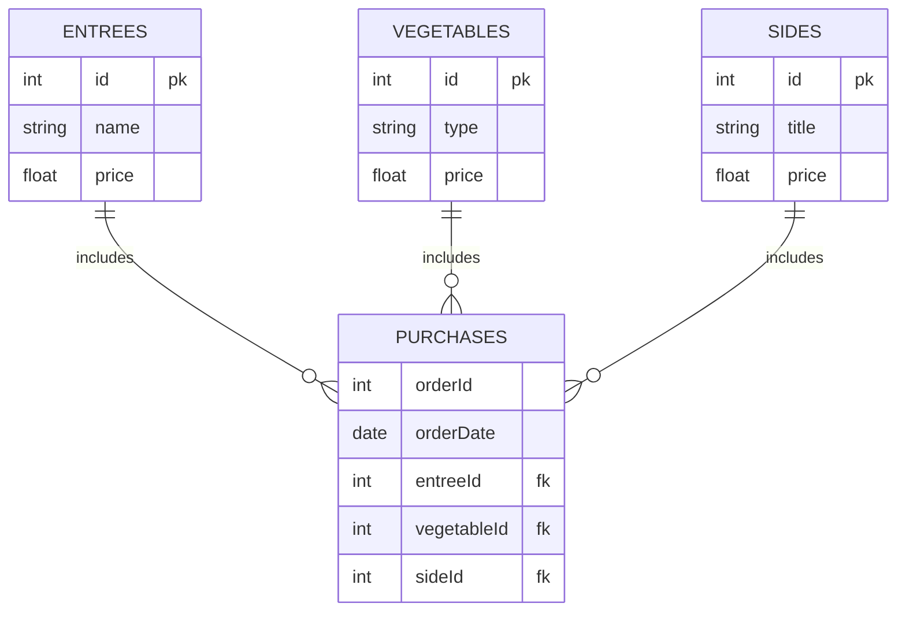

```mermaid
erDiagram

    ENTREES ||--o{ PURCHASES : includes
    VEGETABLES ||--o{ PURCHASES : includes
    SIDES ||--o{ PURCHASES : includes

    PURCHASES {
        int orderId 
        date orderDate
        int entreeId fk
        int vegetableId fk
        int sideId fk
    }
    ENTREES {
        int id pk
        string name
        float price

    }
    VEGETABLES {
        int id pk
        string type
        float price
    }
    SIDES {
        int id pk
        string title
        float price
    }
```